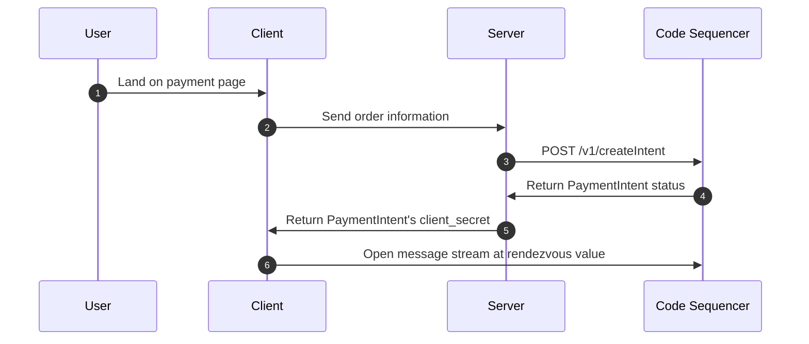

# Server-side Install

While server-side integration is optional, you'll usually want to confirm payment on the server-side. The SDK is split into multiple [packages](./installation#packages), each of which can be installed separately. This allows you to install only the packages you need, and avoid installing unnecessary dependencies. 

A typical server-side integration will look something like this:



You can learn more about the payment flow [here](../intents/payment-requests).

## Installation

::: code-group
```bash [npm]
npm install @code-wallet/client
```

```bash [pip]
pip install code-wallet
```
:::

## Quick Start

Once installed, you can import the SDK into your project.

::: code-group
```js [Node.js / Bun]
import code from '@code-wallet/client';

const { intent } = await code.paymentIntents.create({
    // ...
});
```

```python [Python]
from code_wallet.client.intents import payment_intents

payment_intents.create({
    #...
})
```
:::

See a minimal server example [here](../example/payment-verification). 

::: info Full Examples
If you prefer running full examples, we have a few available.

Checkout the full [Node.js Examples](https://github.com/code-wallet/code-sdk/tree/main/examples) and our [Python Examples](https://github.com/code-wallet/code-sdk-python/tree/main/example)
:::