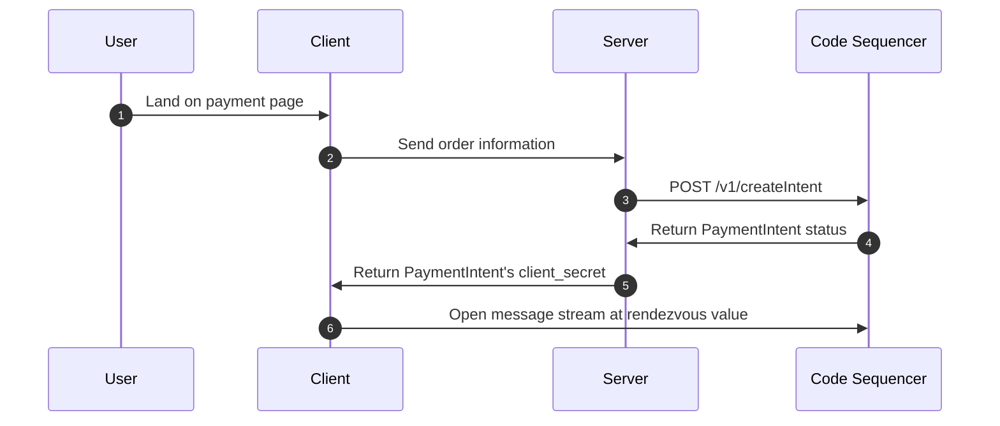

# Server-side Install

While server-side integration is optional, you'll usually want to confirm payment on the server-side. The SDK is split into multiple [packages](./installation#packages), each of which can be installed separately. This allows you to install only the packages you need, and avoid installing unnecessary dependencies. 

A typical server-side integration will look something like this:



You can learn more about the payment flow [here](../intents/payment-requests).

## Installation

::: code-group
```bash [npm]
npm install @code-wallet/client
```

```bash [pip]
pip install code-wallet
```

```bash [php]
composer require code-wallet/client
```

```bash [go]
go get github.com/code-wallet/code-sdk-go
```
:::

## Quick Start

Once installed, you can import the SDK into your project.

::: code-group
```js [node.js / bun]
import code from '@code-wallet/client';

const { intent } = await code.paymentIntents.create({
    // ...
});
```

```python [python]
from code_wallet.client.intents import payment_intents

payment_intents.create({
    #...
})
```

```php [php]
use CodeWallet\Client\PaymentIntents;

$data = [
    'destination' => "E8otxw1CVX9bfyddKu3ZB3BVLa4VVF9J7CTPdnUwT9jR",
    'amount' => 0.05,
    'currency' => 'usd',
];

// Create a payment request intent
$response = PaymentIntents::create($data);

// After some time, you can verify the status of the intent
$status = PaymentIntents::getStatus($response['id']);
```

```go [go]
// Setup the Code web client
client := codesdk.NewWebClient()

// Specify payment request details
intent, err := codesdk.NewPaymentRequestIntent(
  // Or the string "usd"
  codesdk.USD,
  // Minimum amount is $0.05 USD
  0.05,
  // Code Deposit Address or any Kin token account
  "E8otxw1CVX9bfyddKu3ZB3BVLa4VVF9J7CTPdnUwT9jR",
)
check(err)

// Create a payment request intent
_, err = client.CreatePaymentRequest(ctx, intent)
check(err)

// Check the intent status
_, err = client.GetIntentStatus(ctx, intent.GetIntentId())
check(err)
```
:::

See a minimal server example [here](../example/payment-verification). 

::: info Full Examples
If you prefer running full examples, we have a few available.

Checkout the full [Node.js Examples](https://github.com/code-wallet/code-sdk/tree/main/examples), our [Python Example](https://github.com/code-wallet/code-sdk-python/tree/main/example), our [PHP Example](https://github.com/code-wallet/code-sdk-php/tree/main/example), or our [Go Example](https://github.com/code-wallet/code-sdk-go/tree/main/example).
:::