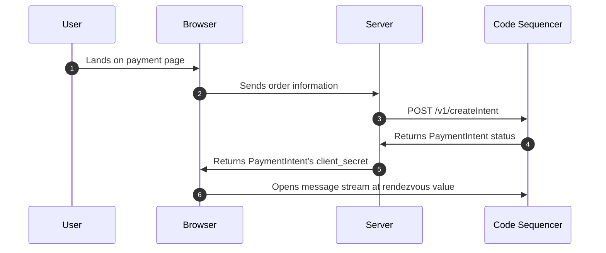
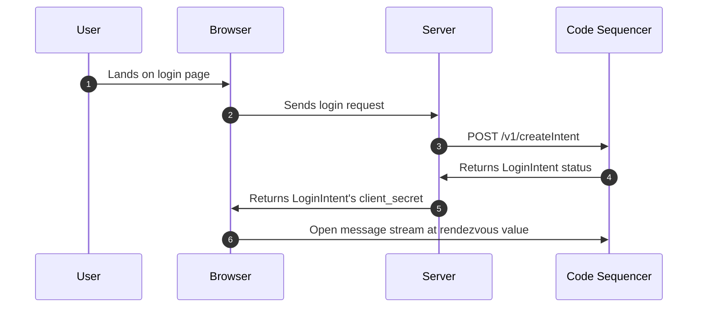

# Code API

The Code API is a [gRPC API](https://grpc.io/) that you can use to send payment intents, login with code, check the status of a payment, verify the payment on your server, and many other things. The API is language-agnostic, which means you can use any language that supports gRPC to interact with the Code API.

If there is a feature that you need that isn't supported by the SDKs yet, you can call the Code API directly. This is useful if you're using a language that isn't supported by the SDKs yet or if you need to implement a custom backend.

::: info 
We recommend using the SDKs to interact with the Code API. The SDKs handle the low-level details of constructing the binary blob that represents the payment intent and signing it with the rendezvous key.
:::

## Getting Started

To get started with the Code API, you'll need to:

1. Find the [protobuf definition](https://github.com/code-payments/code-protobuf-api) for the message you want to send.
2. Construct the binary blob that represents the message.
3. Sign the binary blob
4. Send the signed binary blob to the Code API

The Code API contains a slew of messages that you can send. Each message has its own protobuf definition for the request and response structure.

::: tip
Take a look at the internals of the SDKs to see how the binary blob is constructed and signed. This will give you a good idea of how to construct the binary blob yourself.

* [TypeScript Example](https://github.com/code-payments/code-sdk/tree/94c5cfa6dc84d380a60b9651b17ddad23b7ad3dc/packages/intents/src/intents)
* [Python Example](https://github.com/code-payments/code-sdk-python/blob/main/code_wallet/library/payment_request.py)
* [Go Example](https://github.com/code-payments/code-sdk-go/blob/main/sdk/payment_request.go)
* [PHP Example](https://github.com/code-payments/code-sdk-php/tree/main/src/messages)
:::

## gRPC Proxy

We provide a gRPC proxy that you can use to interact with the Code API without needing to open a socket connection. This is far easier than opening a socket connection and is the recommended way to interact with the Code API. You can also run the proxy on your own server if you'd like.

We use a custom gRPC envelope protocol as the existing gRPC-web libraries do not support bidi streams over HTTP/1 and are [not binary stable](https://github.com/protocolbuffers/protobuf-go/blob/v1.28.1/proto/encode.go#L216-L219). When using the proxy, you'll have to wrap your message in an [envelope](https://github.com/code-payments/code-protobuf-api/blob/05e5a67f9e57da8cdeaac122b0256cb997459a69/proto/common/v1/model.proto#L175-L194), but otherwise it is the same. The proxy will take care of the gRPC communication for you.

Additionally, the proxy is available over HTTP/1.1, which means you can use it in a browser environment.

**Proxy URL (HTTP/1.1)**
```raw
https://api.getcode.com/v1
```

Or you can use the direct gRPC URL, which does require a grpc socket connection.

**Direct gRPC URL (HTTP/2)**
```raw
https://api.codeinfra.net
```

::: tip
Take a look at the [gRPC proxy](https://github.com/code-payments/code-sdk/tree/main/packages/proxy) and each of the SDKs to see how they interact with the Code API.

* [TypeScript Request](https://github.com/code-payments/code-sdk/blob/94c5cfa6dc84d380a60b9651b17ddad23b7ad3dc/packages/client/src/client.ts#L50-L55)
* [Python Request](https://github.com/code-payments/code-sdk-python/blob/2c88e663ccc5e89edb93db5f931bdadb42ccfc1d/code_wallet/client/connection.py#L43-L65)
* [Go Request](https://github.com/code-payments/code-sdk-go/blob/34915b560481a6db8035433dabc2897e388ba8d7/sdk/client.go#L71-L85)
* [PHP Request](https://github.com/code-payments/code-sdk-php/blob/0a2fd9a50706953c3d991a7eca4db014ce496975/src/client/Connection.php#L49-L79)
:::

## Protobuf 

A protobuf definition is a way to define the structure of a message. A protobuf definition is a `.proto` file that defines the structure of a message. It can be compiled into code for many different languages.

All the protobuf definitions for the Code API can be found [here](https://github.com/code-payments/code-protobuf-api). Nearly every language has a protobuf library that can be used to construct the binary blob. You can also construct the binary blob by hand.

If you're unsure about the content of a signed message, how to construct it, where to submit it, or how to verify it, please take a look at the [Typescript](https://github.com/code-payments/code-sdk/blob/main/packages/intents/src/intents/) intents. These are the most up-to-date and accurate representations of the signed messages.

## Intents

Code uses the concept of an intent to represent a user's desired actions. This is different from a blockchain transaction. An intent is a higher-level abstraction.

The Code Sequencer expects a binary blob that represents the intent. The binary blob is constructed using the protobuf definition. When you call the `createIntent` API, you'll need to construct the binary blob yourself and sign it with the [rendezvous key](../reference/rendezvous). 

We have several intent types, such as `RequestToReceiveBill`, `RequestToPayBill`, and `RequestToLogin`. Each intent type has its own protobuf definition.

At a high level, the intent structure looks like this:

```protobuf
message Message {
    MessageId id = 1;
    Signature send_message_request_signature = 3;

    oneof kind {
        RequestToGrabBill     request_to_grab_bill     = 2;
        RequestToReceiveBill  request_to_receive_bill  = 5;
        CodeScanned           code_scanned             = 6;
        ClientRejectedPayment client_rejected_payment  = 7;
        IntentSubmitted       intent_submitted         = 8;
        WebhookCalled         webhook_called           = 9;
        RequestToLogin        request_to_login         = 10;
        ClientRejectedLogin   client_rejected_login    = 12;
        AirdropReceived       airdrop_received         = 4;
    }
}
```

The SDKs are basically wrappers around this protobuf definition. They construct the binary blob for you and sign it with the rendezvous key. If you'd like to use a custom backend or a language that isn't supported yet, it is possible to call our `createIntent` API directly. 

## Example Requests

Below are some examples of how to construct the binary blob for a payment intent and a login intent. These examples are based on the protobuf definitions provided earlier.

## Payment Requests

A typical server-side integration will look something like this:



You can learn more about the payment flow [here](../intents/payment-requests).


In order to call the `createIntent` API manually, you'll need to construct the payment intent binary blob yourself and sign it with the [rendezvous key](../reference/rendezvous). 

You can do that one of two ways:
* **Use a protobuf library to construct the binary blob**
* Construct the binary blob manually

The protobuf defenition for `RequestToReceiveBill` is as follows:

```protobuf

message SolanaAccountId {
    bytes value = 1;
}

message Signature {
    bytes value = 1;
}

message MessageId {
    bytes value = 1;
}

message Message {
    MessageId id = 1;
    Signature send_message_request_signature = 3;

    oneof kind {
        RequestToReceiveBill request_to_receive_bill = 5;
    }
}

message RequestToReceiveBill {
    SolanaAccountId requestor_account = 1;

    oneof exchange_data {
        ExchangeData            exact = 2;
        ExchangeDataWithoutRate partial = 3;
    }
}

message ExchangeData {
    string currency = 1;
    double exchange_rate = 2;
    double native_amount = 3;
    uint64 quarks = 4;
}

message ExchangeDataWithoutRate {
    string currency = 1;
    double native_amount = 2;
}
```

#### Constructing the binary blob manually

Given the above protobuf definition, you can construct a payment intent as follows:

```raw
[
  0x2A, 0x34, 0x0A, 0x22, 0x0A, 0x20, 0x00, 0x00, 0x00, 0x00, 0x00, 0x00,
  0x00, 0x00, 0x00, 0x00, 0x00, 0x00, 0x00, 0x00, 0x00, 0x00, 0x00, 0x00,
  0x00, 0x00, 0x00, 0x00, 0x00, 0x00, 0x00, 0x00, 0x00, 0x00, 0x00, 0x00,
  0x00, 0x00, 0x1A, 0x0E, 0x0A, 0x03, 0x75, 0x73, 0x64, 0x11, 0x00, 0x00,
  0x00, 0x00, 0x00, 0x00, 0x24, 0x40
]
```

#### Decoding the binary blob

Let's decode the given binary serialization based on the protobuf definitions provided earlier.

::: info NOTE
We don't recommend constructing the binary blob manually unless you have a specific reason to do so. It's error-prone and can lead to unexpected behavior.

We describe it here to give you an idea of how the payment intent is constructed and to remove the mystery around the SDKs.
:::

#### Message structure
* `0x2A`: This indicates field number 5 (`request_to_receive_bill`) with a wire type of 2 (length-delimited).
* `0x34`: The length of the upcoming `RequestToReceiveBill` message is 52 bytes.

#### RequestToReceiveBill structure
* `0x0A`: This indicates field number 1 (`requestor_account`) with a wire type of 2 (length-delimited).
* `0x22`: The length of the upcoming `SolanaAccountId` message is 34 bytes.

#### SolanaAccountId structure
* `0x0A`: This indicates field number 1 (value) with a wire type of 2 (length-delimited).
* `0x20`: The length of the upcoming value is 32 bytes.
* Following 32 bytes: 0x00 x 32: This is the account ID in bytes format, which in our example, is all zeros.

#### RequestToReceiveBill structure (continued)

* `0x1A`: This indicates field number 3 (partial, which is of type `ExchangeDataWithoutRate`) with a wire type of 2 (length-delimited).
* `0x0E`: The length of the upcoming `ExchangeDataWithoutRate` message is 14 bytes.

#### ExchangeDataWithoutRate structure:

* `0x0A`: This indicates field number 1 (currency) with a wire type of 2 (length-delimited).
* `0x03`: The length of the currency string is 3 bytes.
* Following 3 bytes: `0x75 0x73 0x64`: This is ASCII for the string `"usd"`.
* `0x11`: This indicates field number 2 (native_amount) with a wire type of 1 (64-bit).
* Following 8 bytes: `0x00 0x00 0x00 0x00 0x00 0x00 0x24 0x40`: This is the number representation of `10.0` for the native amount.

#### Decoded values

From this binary serialization, the values decoded are:
```
request_to_receive_bill:
  requestor_account: 0x00 x 32 (or 'AAAAAAAAAAAAAAAAAAAAAAAAAAAAAAAAAAAAAAAAAAA=' in Base64)
  partial:
    currency: "usd"
    native_amount: 10.0
```

This is then signed using the rendezvous key and `POST`ed to the Code Sequencer's `createIntent` endpoint.

You can see an example of this in our [Python SDK](https://github.com/code-payments/code-sdk-python/blob/main/code_wallet/library/message.py).

## Login intents

The **Login with Code** flow consists of the following steps, you can learn more about the login flow [here](../intents/login).



The login flow is similar to the payment flow, but instead of a payment intent, you'll be creating a login intent. The login intent is a higher-level abstraction that represents a user's intent to log in to a website or application.

The protobuf definition for [RequestToLogin](https://github.com/code-payments/code-protobuf-api/blob/05e5a67f9e57da8cdeaac122b0256cb997459a69/proto/messaging/v1/messaging_service.proto#L318-L342) is as follows:

```Protobuf
message Domain {
  string domain = 1;
}

message SolanaAccountId {
  bytes value = 1;
}

message Signature {
  bytes value = 1;
}

message RendezvousKey {
  bytes value = 1;
}

message Message {
    MessageId id = 1;
    Signature send_message_request_signature = 3;

    oneof kind {
        RequestToLogin request_to_login = 10;
    }
}

message RequestToLogin {
  Domain domain = 1;
  SolanaAccountId verifier = 4;
  Signature signature = 5;
  RendezvousKey rendezvous_key = 6;
}

```

You can construct a login intent using similar logic as the payment intent, but
with the [RequestToLogin](https://github.com/code-payments/code-protobuf-api/blob/05e5a67f9e57da8cdeaac122b0256cb997459a69/proto/messaging/v1/messaging_service.proto#L318-L342) protobuf definition. 

::: tip NOTE
Use the [TypeScript](https://github.com/code-payments/code-sdk/blob/main/packages/intents/src/intents/LoginRequestIntent.ts#L82-L139)
version as a reference for constructing the binary blob.
:::

## Contributing

If you're interested in contributing to the Code SDK, or one of our variants, please reach out to us on [Discord](https://discord.gg/T8Tpj8DBFp) or [Twitter](https://twitter.com/getcode). We're always looking for help with new SDK features, documentation, and examples.

If there is a feature that you need that isn't supported by the SDKs yet, it is likely that someone else needs it too. We can work together to add the feature to the SDKs.
