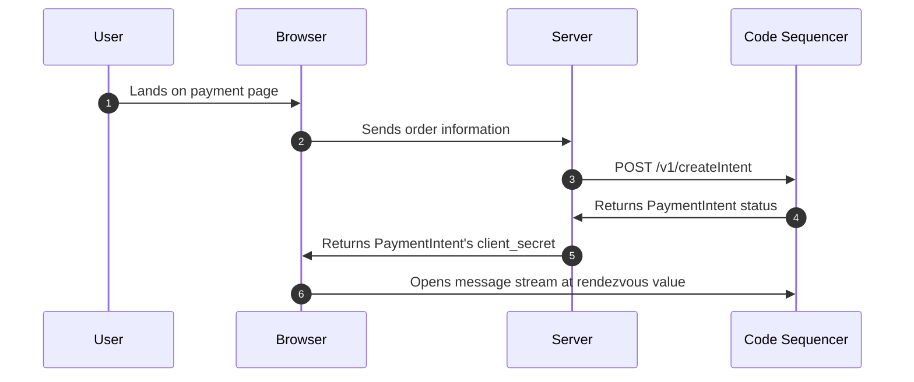
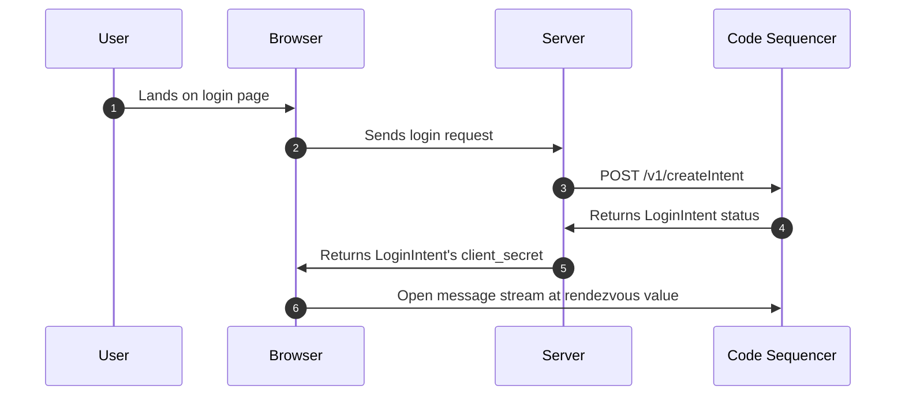

# Code API {#introduction}

The Code API is a [gRPC API](https://grpc.io/) service designed to handle various actions such as creating `Payment Requests`, `Login With Code`, checking intent status, and more. Being language-agnostic, you can use any programming language that supports gRPC to interact with the Code API.

If you require a feature that isn't yet supported by our SDKs, you can directly call the Code API. This approach is particularly useful if you're working with an unsupported language or need to implement something more custom.

::: info Recommendation
When possible, we encourage using our SDKs to interact with the Code API. The SDKs manage the low-level details of constructing the binary blob that represents the payment Intent and signing it with the [rendezvous key](../reference/rendezvous).
:::

## Getting Started {#getting-started}

To begin using the Code API, follow these steps:

1. **Familiarize yourself with [Protobuf](https://developers.google.com/protocol-buffers)**, the serialization format used by the Code API.
2. **Locate the [Protobuf Definition](https://github.com/code-payments/code-protobuf-api)** for the message you intend to send.
3. **Construct the binary blob** representing the message.
4. **Sign the binary blob** with your [rendezvous key](../reference/rendezvous).
5. **Send the signed binary blob** to the Code API.

The Code API supports a wide range of messages, each with its own Protobuf definition for request and response structures.

## Protobuf {#protobuf}

We use [Protocol Buffers](https://developers.google.com/protocol-buffers) (protobuf) to define the structure of messages sent to and received from the Code API.

A protobuf definition is a way to define the structure of a message; simply a text file with a `.proto` extension. This file can be compiled into source code for many different languages. These can then be used to serialize and deserialize messages into a binary format (more compact).

```proto
syntax = "proto3";

message Person {
  string name = 1; // Field number 1
  int32 age = 2;   // Field number 2
}
```

All the protobuf definitions for the Code API can be found [here](https://github.com/code-payments/code-protobuf-api). Nearly every language has a protobuf library that can be used to construct the binary blob. **You can also construct the binary blob by hand**. 

::: tip
You can play around with the [Protobuf Playground](https://www.protobufpal.com/) to get a feel for how it works.
:::

If you're unsure about the content of a signed message, how to construct it, where to submit it, or how to verify it, please take a look at the [TypeScript](https://github.com/code-payments/code-sdk/blob/main/packages/intents/src/intents/) intents. These are the most up-to-date and accurate representations of the signed messages.

## gRPC {#grpc}

While we use `protobuf` to define the structure of messages, we use `gRPC` to send and receive these messages. The gRPC protocol is a high-performance, open-source, universal RPC framework. It is designed and maintained by Google.

We make use of gRPC tooling that generates client and server code in multiple languages, making it easy to interact with the Code API.

### Web Proxy {#grpc-proxy}

Typically, gRPC requires a direct socket connection to the server. However, this can be difficult to set up in some environments. **Specifically, it can be challenging to use gRPC in a browser environment**.

We provide a custom `HTTP/1.1` gRPC proxy that you can use to interact with the Code API without needing to open a socket connection. This is far easier than opening a socket connection and is the recommended way to interact with the Code API. You can also run the proxy on your own server if you'd like.

Additionally, the proxy is available over HTTP/1.1, which means you can use it in a browser environment.

::: info Recommendation
We recommend using the gRPC proxy to interact with the Code API. It allows you to use simple `fetch(...)` requests to interact with the API instead of opening a socket connection.
:::

## Mainnet Endpoints {#endpoints}

You can use the following URLs to interact with the Code API:

**Proxy URL (HTTP/1.1)**
```raw
https://cash.getcode.com/v1/api
```

Or you can use the direct gRPC URL, which does require a grpc socket connection.

**Direct gRPC URL (HTTP/2)**
```raw
https://api.codeinfra.net
```

## Building Your Own Client {#building-a-client}

When the SDK doesn’t yet support a feature you need, you can build your own client to interact directly with the Code API. In this section, we explain the Code API `envelope protocol` and provide minimal examples using JavaScript, Python, PHP, and Go.

### Request/Response Protocol (HTTP/1.1)

The Code API wraps your inner messages (such as a payment or login Intent) in a simple envelope defined using Protocol Buffers. If you're using our `HTTP/2` endpoint, you can skip this section.

The proto definitions are:

```proto
syntax = "proto3";

message Request {
    string version = 1;
    string service = 2;
    string method = 3;
    bytes body = 4;
}

message Response {
    Result result = 1;
    bytes body = 2;
    string message = 3;

    enum Result {
        OK = 0;
        ERROR = 1;
    }
}
```


::: details
For example, the following `Request`:

```json
{
  "version": "1.0",
  "service": "Messaging",
  "method": "sendMessage", 
  "body": [1, 2, 3, 4]
}

```

- **version**: The API version (e.g. `"1.0"`).
- **service**: The target service (e.g. `"Messaging"`).
- **method**: The method to invoke (e.g. `"sendMessage"`).
- **body**: The binary-serialized payload of your inner message.

Serializes to the following hex string:

```raw
0a03312e3012094d6573736167696e671a0b73656e644d657373616765220401020304
```
:::

### Sending a Request 
Below is a minimal JavaScript example that wraps your protobuf-serialized payload in a `Request` envelope and sends it via `HTTP/1.1` POST.

::: code-group

```javascript [js]
import { Request, Response } from '@code-wallet/rpc';

// Assume you already have your payload message 
// (e.g. a payment or login Intent) that has been 
// encoded (and signed) using its protobuf definition.
const payload = myProtoMessage.toBinary();

// Wrap the payload in a Request envelope
const envelope = new Request({
  version: "1.0",
  service: "Intents",     // e.g. "Messaging"
  method: "sendMessage", // e.g. "sendMessage"
  body: payload,
});

// Serialize the envelope to binary
const binaryEnvelope = envelope.toBinary();

// Send the binary envelope using an HTTP POST
fetch("https://cash.getcode.com/v1/api", {
  method: "POST",
  headers: { "Content-Type": "application/octet-stream" },
  body: binaryEnvelope,
})
  .then(response => response.arrayBuffer())
  .then(buffer => {
    // Decode the response envelope from binary
    const resEnvelope = Response.fromBinary(new Uint8Array(buffer));
    console.log("Received response:", resEnvelope);
  })
  .catch(err => console.error("Network error:", err));
```

```python [python]
import requests

# We don't yet have a Python library for encoding/decoding 
# the CodeAPI protobuf messages. 

# However, you can build your own.
# More details here: https://protobuf.dev/getting-started/pythontutorial/

# In this example, we're just going to do it 
# manually (not recommended but simple).
def encode_varint(value):
    """Encode an integer as a protobuf varint."""
    result = bytearray()
    while True:
        to_write = value & 0x7F
        value >>= 7
        if value:
            result.append(to_write | 0x80)
        else:
            result.append(to_write)
            break
    return bytes(result)

def encode_length_delimited(field_number, data_bytes):
    """
    Encode a length-delimited field.
    For proto fields of type string or bytes:
      - Tag: (field_number << 3) | 2 (wire type 2)
      - Length: varint-encoded length of data_bytes
      - Value: the raw bytes
    """
    tag = (field_number << 3) | 2
    return encode_varint(tag) + encode_varint(len(data_bytes)) + data_bytes

# Prepare the fields for the Request message.
version = "1.0".encode("utf-8")
service = "Messaging".encode("utf-8")
method  = "sendMessage".encode("utf-8")
body    = bytes([1, 2, 3, 4])  # Example payload

# Manually serialize the Request message by concatenating each field.
serialized = (
    encode_length_delimited(1, version) +
    encode_length_delimited(2, service) +
    encode_length_delimited(3, method) +
    encode_length_delimited(4, body)
)

# The expected hex serialization:
# 0a03312e3012094d6573736167696e671a0b73656e644d657373616765220401020304
print("Serialized Request:", serialized.hex())

# Send the serialized request via HTTP POST.
response = requests.post(
    "https://cash.getcode.com/v1/api",
    headers={"Content-Type": "application/octet-stream"},
    data=serialized
)

if response.ok:
    # For demonstration, print the raw response bytes in hex.
    print("Response:", response.content.hex())
else:
    print("Request failed with status code:", response.status_code)

```

```php [php]
# We don't yet have a Php library for encoding/decoding 
# the CodeAPI protobuf messages.

# In this example, we're just going to do it 
# manually (not recommended but simple).

function encodeVarint($value) {
    $result = '';
    while (true) {
        $toWrite = $value & 0x7F;
        $value >>= 7;
        if ($value) {
            $result .= chr($toWrite | 0x80);
        } else {
            $result .= chr($toWrite);
            break;
        }
    }
    return $result;
}

function encodeLengthDelimited($fieldNumber, $dataBytes) {
    $tag = ($fieldNumber << 3) | 2;
    return encodeVarint($tag) . encodeVarint(strlen($dataBytes)) . $dataBytes;
}

// Prepare the fields for the Request message.
$version = "1.0";
$service = "Intents";
$method  = "createIntent";
$body    = chr(1) . chr(2) . chr(3) . chr(4);  // Example payload

// Manually serialize the Request message.
$serialized = 
    encodeLengthDelimited(1, $version) .
    encodeLengthDelimited(2, $service) .
    encodeLengthDelimited(3, $method) .
    encodeLengthDelimited(4, $body);

echo "Serialized Request: " . bin2hex($serialized) . "\n";

// Send the serialized request via HTTP POST using cURL.
$ch = curl_init("https://cash.getcode.com/v1/api");
curl_setopt($ch, CURLOPT_POST, true);
curl_setopt($ch, CURLOPT_HTTPHEADER, array("Content-Type: application/octet-stream"));
curl_setopt($ch, CURLOPT_POSTFIELDS, $serialized);
curl_setopt($ch, CURLOPT_RETURNTRANSFER, true);

$response = curl_exec($ch);
if (curl_errno($ch)) {
    echo "Request failed: " . curl_error($ch) . "\n";
} else {
    echo "Response: " . bin2hex($response) . "\n";
}
curl_close($ch);

```

```go [go]
package main

import (
	"bytes"
	"encoding/hex"
	"fmt"
	"io/ioutil"
	"net/http"
)

// You can use our library to encode/decode the CodeAPI protobuf messages.
// https://github.com/code-payments/code-protobuf-api/tree/main/generated/go

// We're going to do it manually (not recommended but simple).
func encodeVarint(value uint64) []byte {
	var buf []byte
	for {
		b := byte(value & 0x7F)
		value >>= 7
		if value != 0 {
			buf = append(buf, b|0x80)
		} else {
			buf = append(buf, b)
			break
		}
	}
	return buf
}

func encodeLengthDelimited(fieldNumber int, data []byte) []byte {
	tag := uint64((fieldNumber << 3) | 2)
	var buf bytes.Buffer
	buf.Write(encodeVarint(tag))
	buf.Write(encodeVarint(uint64(len(data))))
	buf.Write(data)
	return buf.Bytes()
}

func main() {
	version := []byte("1.0")
	service := []byte("Intents")
	method := []byte("createIntent")
	body := []byte{1, 2, 3, 4} // Example payload

	var serialized bytes.Buffer
	serialized.Write(encodeLengthDelimited(1, version))
	serialized.Write(encodeLengthDelimited(2, service))
	serialized.Write(encodeLengthDelimited(3, method))
	serialized.Write(encodeLengthDelimited(4, body))

	serializedBytes := serialized.Bytes()
	fmt.Println("Serialized Request:", hex.EncodeToString(serializedBytes))

	// Send HTTP POST
	resp, err := http.Post(
        "https://cash.getcode.com/v1/api", 
        "application/octet-stream",
        bytes.NewReader(serializedBytes)
    )
	if err != nil {
		fmt.Println("Request failed:", err)
		return
	}
	defer resp.Body.Close()
	responseBody, _ := ioutil.ReadAll(resp.Body)
	fmt.Println("Response:", hex.EncodeToString(responseBody))
}
```
:::

The above examples show how to construct a `Request` envelope and send it to the Code API. The response is also wrapped in a `Response` envelope. You can then extract the binary-encoded payload from the response and decode it using the appropriate protobuf definition.

You can learn more about the payload structure below.

::: info Recommendation
Take a look at the following client implementations that use our `HTTP/1.1` gRPC proxy.

* [TypeScript Client](https://github.com/code-payments/code-sdk/blob/94c5cfa6dc84d380a60b9651b17ddad23b7ad3dc/packages/client/src/client.ts#L50-L55)
* [Python Client](https://github.com/code-payments/code-sdk-python/blob/2c88e663ccc5e89edb93db5f931bdadb42ccfc1d/code_wallet/client/connection.py#L43-L65)
* [Go Client](https://github.com/code-payments/code-sdk-go/blob/34915b560481a6db8035433dabc2897e388ba8d7/sdk/client.go#L71-L85)
* [PHP Client](https://github.com/code-payments/code-sdk-php/blob/0a2fd9a50706953c3d991a7eca4db014ce496975/src/client/Connection.php#L49-L79)
:::

### HTTP/2 gRPC Endpoint

Additionally, you can also use our `HTTP/2` gRPC endpoint directly. This requires a gRPC client library that supports gRPC over `HTTP/2`. 

Our golang, iOS and Android SDKs use this method.

::: info
Take a look at the following client implementations that use our `HTTP/2` gRPC endpoint directly.

* [Go Client](https://github.com/code-payments/code-protobuf-api/tree/main/generated/go)
* [Swift Client](https://github.com/code-payments/code-ios-app/tree/main/CodeServices/Sources/CodeServices/API)
* [Kotlin Client](https://github.com/code-payments/code-android-app/tree/main/api)
:::

## Intents {#intents}

Code uses the concept of an [Intent](../intents/introduction.md) to represent a user's desired actions. This is different from a blockchain transaction. An Intent is a higher-level abstraction.

The Code Sequencer expects a binary blob that represents the Intent. The binary blob is constructed using the protobuf definition. When you call the `createIntent` API, you'll need to construct the binary blob yourself and sign it with the [rendezvous key](../reference/rendezvous). 

We have several Intent types, such as `RequestToReceiveBill`, `RequestToPayBill`, and `RequestToLogin`. Each Intent type has its own protobuf definition.

::: details
At a high level, the Intent structure looks like this:

```proto
message Message {
    MessageId id = 1;
    Signature send_message_request_signature = 3;

    oneof kind {
        RequestToGrabBill     request_to_grab_bill     = 2;
        RequestToReceiveBill  request_to_receive_bill  = 5;
        CodeScanned           code_scanned             = 6;
        ClientRejectedPayment client_rejected_payment  = 7;
        IntentSubmitted       intent_submitted         = 8;
        WebhookCalled         webhook_called           = 9;
        RequestToLogin        request_to_login         = 10;
        ClientRejectedLogin   client_rejected_login    = 12;
        AirdropReceived       airdrop_received         = 4;
    }
}
```
:::

The SDKs are basically wrappers around this protobuf definition. They construct the binary blob for you and sign it with the rendezvous key. If you'd like to use a custom backend or a language that isn't supported yet, it is possible to call our `createIntent` API directly. 

::: info Recommendation
Take a look at the internals of the SDKs to see how the binary blob is constructed and signed. This will give you a good idea of how to construct the binary blob yourself.

* [TypeScript Example](https://github.com/code-payments/code-sdk/tree/94c5cfa6dc84d380a60b9651b17ddad23b7ad3dc/packages/intents/src/intents)
* [Python Example](https://github.com/code-payments/code-sdk-python/blob/main/code_wallet/library/payment_request.py)
* [Go Example](https://github.com/code-payments/code-sdk-go/blob/main/sdk/payment_request.go)
* [PHP Example](https://github.com/code-payments/code-sdk-php/tree/main/src/messages)
:::

Below are some examples of how to construct the binary blob for a payment Intent and a login Intent. These examples are based on the protobuf definitions provided earlier. You'll need to sign and wrap these payloads in a `Request` envelope before sending them to the Code API.

## GetStatus Example {#get-status}

In this example, we’ll query the status of an intent by sending a `GetStatusRequest` message. This service is simple because it doesn’t require a signature. 

We will:

- Encode a `GetStatusRequest` message.
- Wrap it in a `Request` envelope.
- Save the binary payload to a file.
- Use `cURL` to send the request.
- Interpret the response.

All without using any SDKs or **writing any code** (JavaScript version is [here](https://github.com/code-payments/code-sdk/blob/4e06113e234f873e2b160f90f27244e6e92c5991/packages/client/test/client.test.ts#L13-L28)).

::: info Recommendation
We don't recommend constructing the binary blob manually or by hand unless you have a specific reason to do so. It's error-prone and can lead to unexpected behavior. Use a protobuf library to construct the binary blob.

https://protobuf.dev/getting-started/
:::


::: details
First, here are the relevant protobuf definitions. We will use the [protobuf
playground](https://www.protobufpal.com/) to encode and decode the messages.

```proto
syntax = "proto3";

message IntentId {
    bytes value = 1;
}

message GetStatusRequest {
    IntentId intent_id = 1;
}

message GetStatusResponse {
    bool exists = 1;
    bool code_scanned = 2;
    bool intent_submitted = 3;
}

message Request {
    string version = 1;
    string service = 2;
    string method = 3;
    bytes body = 4;
}

message Response {
    Result result = 1;
    bytes body = 2;
    string message = 3;

    enum Result {
        OK = 0;
        ERROR = 1;
    }
}
```
:::

### Step 1: Convert the Base58 Intent ID to a Byte Array
Lets assume we made a payment in the past using the Code app and have a Intent id. Our intent ID is given in Base58 as: `9sK9x3MC7yEMzfA5VRRcu2P72gCGGsF1htpeAMXae9bz`

::: details
You can convert this Base58 string to a byte array without writing any code by using an online converter:

1) Visit an online Base58 converter:
For example, try the [AppDevTools Base58 Encoder/Decoder](https://www.appdevtools.com/base58-encoder-decoder).

2) Paste the Base58 string:
Enter `9sK9x3MC7yEMzfA5VRRcu2P72gCGGsF1htpeAMXae9bz` in the input field.

3) Convert to Hexadecimal:
The tool will decode the Base58 string and output its hexadecimal representation.

4) Convert Hex to a Decimal Array.
Copy the hexadecimal string and convert it to a decimal array using the following command:
```bash
echo "83c110200748f37e98f0ae36802eebcc605f023a1661f3731c3620b470c78325" \
 | sed 's/\(..\)/0x\1 /g' \
 | xargs printf "%d "
```
:::

When converted to a byte array, the intent ID is represented as:
```raw
[ 131, 193, 16, 32, 7, 72, 243, 126, 152, 240, 174, 54, 128, 46, 235, 204,
  96, 95, 2, 58, 22, 97, 243, 115, 28, 54, 32, 180, 112, 199, 131, 37 ]
```

### Step 2: Encode the GetStatusRequest Message

When encoded, this produces the following hex string:

::: details
Using the byte array from Step 1, construct the JSON for the `GetStatusRequest` message:

```json
{
  "intent_id": {
    "value": [
      131, 193, 16, 32, 7, 72, 243, 126, 152, 240, 174, 54, 128, 46, 235, 204,
      96, 95, 2, 58, 22, 97, 243, 115, 28, 54, 32, 180, 112, 199, 131, 37
    ]
  }
}
```
:::

```raw
0a220a2083c110200748f37e98f0ae36802eebcc605f023a1661f3731c3620b470c78325
```

### Step 3: Create the Request Envelope
Wrap the `GetStatusRequest` binary payload in a higher-level Request envelope. 

Use the following values:

- **version**: (empty in this example, this field is optional)
- **service**: "MicroPayment"
- **method**: "getStatus" (note the camelCase)
- **body**: The byte array from the previous step

This envelope is encoded into the following final hex string:

```raw
0a00120c4d6963726f5061796d656e741a0967657453746174757322240a220a2083c110200748f37e98f0ae36802eebcc605f023a1661f3731c3620b470c78325
```

### Step 4: Save the Binary Payload to a File
Save the final hex string to a file called request.bin.

::: details
You can do this using the following command:

```bash
echo -n "0a00120c4d6963726f5061796d656e741a0967657453746174757322240a220a2083c110200748f37e98f0ae36802eebcc605f023a1661f3731c3620b470c78325" \
    | xxd -r -p > request.bin
```

Explanation:

* `echo -n "..."` outputs the hex string without a newline.
* `xxd -r -p` converts the hex string back into binary.
:::

The result is saved in `request.bin`.

### Step 5: Send the Request Using cURL
Now, send the request to the Code API with cURL:


```bash
curl -X POST "https://cash.getcode.com/v1/api" \
  -H "Content-Type: application/octet-stream" \
  --data-binary @request.bin | xxd
```

::: details
Explanation:

- `-X POST` specifies a POST request.
- `-H "Content-Type: application/octet-stream"` sets the content type to binary.
- `--data-binary @request.bin` sends the binary data from request.bin.

The response is piped to `xxd` to display it in hex format.
:::

### Step 6: Interpret the Response
Use the protobuf definition for `GetStatusResponse` to interpret the response. 

::: details
A successful response should look like this:

```json
{
  "result": "OK",
  "body": [ 8, 1, 16, 1, 24, 1 ], // hex: 080110011801
  "message": ""
}
```
:::

When decoded using the GetStatusResponse protobuf definition, it represents:

```json
{
  "exists": true,
  "code_scanned": true,
  "intent_submitted": true
}
```

* The result indicates overall success `(OK)`.
* The body contains the binary-encoded response, which, when decoded, confirms that the intent `exists`, has been `scanned`, and `submitted`.
* The message is empty, meaning no error details were provided.


## Payment Example {#payment-requests}

A typical server-side integration will look something like this:



You can learn more about the payment flow [here](../intents/payment-requests).

In order to call the `createIntent` API manually, you'll need to construct the payment Intent binary blob yourself and sign it with the [rendezvous key](../reference/rendezvous). 

You can do that one of two ways:
* **Use a protobuf library to create the binary payload**
* Construct the binary payload manually

The protobuf defenition for `RequestToReceiveBill` is as follows (full definition can be found [here](https://github.com/code-payments/code-protobuf-api)):

::: details
```proto
syntax = "proto3";

message SolanaAccountId {
    bytes value = 1;
}

message Signature {
    bytes value = 1;
}

message MessageId {
    bytes value = 1;
}

message Message {
    MessageId id = 1;
    Signature send_message_request_signature = 3;

    oneof kind {
        RequestToReceiveBill request_to_receive_bill = 5;
    }
}

message RequestToReceiveBill {
    SolanaAccountId requestor_account = 1;

    oneof exchange_data {
        ExchangeData            exact = 2;
        ExchangeDataWithoutRate partial = 3;
    }
}

message ExchangeData {
    string currency = 1;
    double exchange_rate = 2;
    double native_amount = 3;
    uint64 quarks = 4;
}

message ExchangeDataWithoutRate {
    string currency = 1;
    double native_amount = 2;
}
```
:::

### Binary Message

Given the protobuf definition, you can construct a `RequestToReceiveBill` as follows:

```raw
[
  0x2A, 0x34, 0x0A, 0x22, 0x0A, 0x20, 0x00, 0x00, 0x00, 0x00, 0x00, 0x00,
  0x00, 0x00, 0x00, 0x00, 0x00, 0x00, 0x00, 0x00, 0x00, 0x00, 0x00, 0x00,
  0x00, 0x00, 0x00, 0x00, 0x00, 0x00, 0x00, 0x00, 0x00, 0x00, 0x00, 0x00,
  0x00, 0x00, 0x1A, 0x0E, 0x0A, 0x03, 0x75, 0x73, 0x64, 0x11, 0x00, 0x00,
  0x00, 0x00, 0x00, 0x00, 0x24, 0x40
]
```

For the following data:

```json
{
  "requestor_account": "AAAAAAAAAAAAAAAAAAAAAAAAAAAAAAAAAAAAAAAAAAA=",
  "partial": {
    "currency": "usd",
    "native_amount": 10.0
  }
}
```

::: details
Let's decode the given binary serialization based on the protobuf definitions provided earlier.

#### Message structure
* `0x2A`: This indicates field number 5 (`request_to_receive_bill`) with a wire type of 2 (length-delimited).
* `0x34`: The length of the upcoming `RequestToReceiveBill` message is 52 bytes.

#### RequestToReceiveBill structure
* `0x0A`: This indicates field number 1 (`requestor_account`) with a wire type of 2 (length-delimited).
* `0x22`: The length of the upcoming `SolanaAccountId` message is 34 bytes.

#### SolanaAccountId structure
* `0x0A`: This indicates field number 1 (value) with a wire type of 2 (length-delimited).
* `0x20`: The length of the upcoming value is 32 bytes.
* Following 32 bytes: 0x00 x 32: This is the account ID in bytes format, which in our example, is all zeros.

#### RequestToReceiveBill structure (continued)

* `0x1A`: This indicates field number 3 (partial, which is of type `ExchangeDataWithoutRate`) with a wire type of 2 (length-delimited).
* `0x0E`: The length of the upcoming `ExchangeDataWithoutRate` message is 14 bytes.

#### ExchangeDataWithoutRate structure:

* `0x0A`: This indicates field number 1 (currency) with a wire type of 2 (length-delimited).
* `0x03`: The length of the currency string is 3 bytes.
* Following 3 bytes: `0x75 0x73 0x64`: This is ASCII for the string `"usd"`.
* `0x11`: This indicates field number 2 (native_amount) with a wire type of 1 (64-bit).
* Following 8 bytes: `0x00 0x00 0x00 0x00 0x00 0x00 0x24 0x40`: This is the number representation of `10.0` for the native amount.

#### Decoded values

From this binary serialization, the values decoded are:

```json
{
  "requestor_account": "AAAAAAAAAAAAAAAAAAAAAAAAAAAAAAAAAAAAAAAAAAA=",
  "partial": {
    "currency": "usd",
    "native_amount": 10.0
  }
}
```
:::

This is then signed using the rendezvous key and `POST`ed to the Code Sequencer's `createIntent` endpoint.

You can see an example of this in our [Python SDK](https://github.com/code-payments/code-sdk-python/blob/main/code_wallet/library/message.py).

## Login Example {#login-intents}

The **Login with Code** flow consists of the following steps, you can learn more about the login flow [here](../intents/login).



The login flow is similar to the payment flow, but instead of a payment Intent, you'll be creating a login Intent. The login Intent is a higher-level abstraction that represents a user's Intent to log in to a website or application.

::: details
The protobuf definition for [RequestToLogin](https://github.com/code-payments/code-protobuf-api/blob/05e5a67f9e57da8cdeaac122b0256cb997459a69/proto/messaging/v1/messaging_service.proto#L318-L342) is as follows:

```proto
syntax = "proto3";

message Domain {
  string domain = 1;
}

message SolanaAccountId {
  bytes value = 1;
}

message Signature {
  bytes value = 1;
}

message RendezvousKey {
  bytes value = 1;
}

message MessageId {
    bytes value = 1;
}

message Message {
    MessageId id = 1;
    Signature send_message_request_signature = 3;

    oneof kind {
        RequestToLogin request_to_login = 10;
    }
}

message RequestToLogin {
  Domain domain = 1;
  SolanaAccountId verifier = 4;
  Signature signature = 5;
  RendezvousKey rendezvous_key = 6;
}

```
:::

You can construct a login Intent using similar logic as the payment Intent, but
with the [RequestToLogin](https://github.com/code-payments/code-protobuf-api/blob/05e5a67f9e57da8cdeaac122b0256cb997459a69/proto/messaging/v1/messaging_service.proto#L318-L342) protobuf definition. 

::: info
Use the [TypeScript](https://github.com/code-payments/code-sdk/blob/main/packages/intents/src/intents/LoginRequestIntent.ts#L82-L139)
version as a reference for constructing the binary blob.
:::

## Contributing

If you're interested in contributing to the Code SDK, or one of our variants, please reach out to us on [Discord](https://discord.gg/T8Tpj8DBFp) or [Twitter](https://twitter.com/getcode). We're always looking for help with new SDK features, documentation, and examples.

If there is a feature that you need that isn't supported by the SDKs yet, it is likely that someone else needs it too. We can work together to add the feature to the SDKs.
