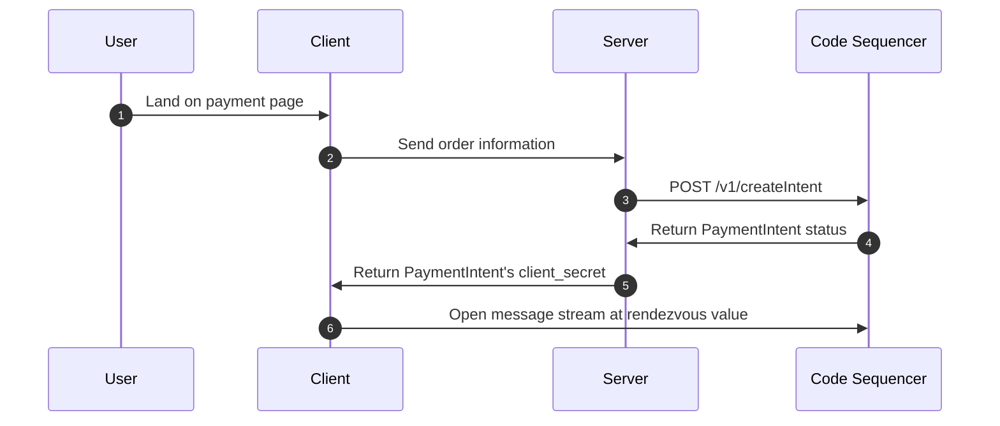

# Custom Backends

Code uses the concept of a payment intent to represent a user's intent to pay another user. This is different from a blockchain transaction. A payment intent is a higher-level abstraction that represents a user's intent to pay another user which is a way to represent a payment in a way that's more familiar to users.

Unless you have a specific reason to use a custom backend, we recommend using one of our SDK [packages](../guide/installation#packages) to construct the payment request intent. You can learn more about the payment flow [here](../intents/payment-requests).

::: warning
This page is strictly for those who want to use a custom backend or a language that isn't supported yet. This is an advanced topic and we recommend using one of our SDKs to construct the payment request intent.
:::

## Payment Request Intents

If you'd like to use a custom backend or a language that isn't supported yet, it is possible to call our `createIntent` API directly. 

A typical server-side integration will look something like this:



You can learn more about the payment flow [here](../intents/payment-requests).


In order to call the `createIntent` API manually, you'll need to construct the payment intent binary blob yourself and sign it with the [rendezvous key](../reference/rendezvous). 

You can do that one of two ways:
* Use a protobuf library to construct the binary blob
* Construct the binary blob manually

### Protobuf
The protobuf defenition for `RequestToReceiveBill` is as follows:

```protobuf

message SolanaAccountId {
    bytes value = 1;
}

message Signature {
    bytes value = 1;
}

message MessageId {
    bytes value = 1;
}

message Message {
    MessageId id = 1;
    Signature send_message_request_signature = 3;

    oneof kind {
        RequestToReceiveBill request_to_receive_bill = 5;
    }
}

message RequestToReceiveBill {
    SolanaAccountId requestor_account = 1;

    oneof exchange_data {
        ExchangeData            exact = 2;
        ExchangeDataWithoutRate partial = 3;
    }
}

message ExchangeData {
    string currency = 1;
    double exchange_rate = 2;
    double native_amount = 3;
    uint64 quarks = 4;
}

message ExchangeDataWithoutRate {
    string currency = 1;
    double native_amount = 2;
}
```

### Example

Given the above protobuf definition, you can construct a payment intent as follows:

```raw
[
  0x2A, 0x34, 0x0A, 0x22, 0x0A, 0x20, 0x00, 0x00, 0x00, 0x00, 0x00, 0x00,
  0x00, 0x00, 0x00, 0x00, 0x00, 0x00, 0x00, 0x00, 0x00, 0x00, 0x00, 0x00,
  0x00, 0x00, 0x00, 0x00, 0x00, 0x00, 0x00, 0x00, 0x00, 0x00, 0x00, 0x00,
  0x00, 0x00, 0x1A, 0x0E, 0x0A, 0x03, 0x75, 0x73, 0x64, 0x11, 0x00, 0x00,
  0x00, 0x00, 0x00, 0x00, 0x24, 0x40
]
```

Let's decode the given binary serialization based on the protobuf definitions provided earlier.

#### Message structure
* `0x2A`: This indicates field number 5 (`request_to_receive_bill`) with a wire type of 2 (length-delimited).
* `0x34`: The length of the upcoming `RequestToReceiveBill` message is 52 bytes.

#### RequestToReceiveBill structure
* `0x0A`: This indicates field number 1 (`requestor_account`) with a wire type of 2 (length-delimited).
* `0x22`: The length of the upcoming `SolanaAccountId` message is 34 bytes.

#### SolanaAccountId structure
* `0x0A`: This indicates field number 1 (value) with a wire type of 2 (length-delimited).
* `0x20`: The length of the upcoming value is 32 bytes.
* Following 32 bytes: 0x00 x 32: This is the account ID in bytes format, which in our example, is all zeros.

#### RequestToReceiveBill structure (continued)

* `0x1A`: This indicates field number 3 (partial, which is of type `ExchangeDataWithoutRate`) with a wire type of 2 (length-delimited).
* `0x0E`: The length of the upcoming `ExchangeDataWithoutRate` message is 14 bytes.

#### ExchangeDataWithoutRate structure:

* `0x0A`: This indicates field number 1 (currency) with a wire type of 2 (length-delimited).
* `0x03`: The length of the currency string is 3 bytes.
* Following 3 bytes: `0x75 0x73 0x64`: This is ASCII for the string `"usd"`.
* `0x11`: This indicates field number 2 (native_amount) with a wire type of 1 (64-bit).
* Following 8 bytes: `0x00 0x00 0x00 0x00 0x00 0x00 0x24 0x40`: This is the number representation of `10.0` for the native amount.

#### Decoded values

From this binary serialization, the values decoded are:
```
request_to_receive_bill:
  requestor_account: 0x00 x 32 (or 'AAAAAAAAAAAAAAAAAAAAAAAAAAAAAAAAAAAAAAAAAAA=' in Base64)
  partial:
    currency: "usd"
    native_amount: 10.0
```

This is then signed using the rendezvous key and `POST`ed to the Code Sequencer's `createIntent` endpoint.

You can see an example of this in our [Python SDK](https://github.com/code-payments/code-sdk-python/blob/main/code_wallet/library/message.py).

