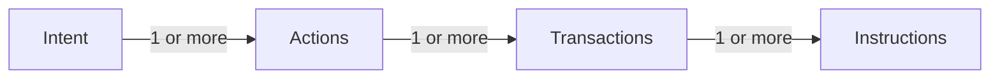

# Intents

The Code SDK revolutionizes Solana transactions by introducing `Intents` instead of directly submitting transactions. An intent encapsulates a user's desired action, abstracting away the underlying blockchain complexities. The Code Sequencer automatically converts these intents into the necessary blockchain transactions.

## Intent vs. Transaction

- **Abstraction:**  
  Intents represent high-level user actions without exposing blockchain intricacies. The Code Sequencer handles the conversion into blockchain transactions.

- **Sequencing with Code Sequencer:**  
  Unlike traditional wallets, the Code Sequencer breaks down intents into individual transactions using nonce values, ensuring proper execution on Solana.

- **Secure Communication:**  
  Only signatures are sent to the Sequencer, preventing any alteration of transactions. This ensures consistency and integrity between the app and Sequencer.

- **Privacy:**  
  Transactions are processed through the splitter contract, which obscures transaction details on-chain, safeguarding user privacy.

## Getting Started with Intents

Currently, the SDK supports a subset of intents, primarily `PaymentIntent`. For intents not yet supported, you can utilize the raw `@code-wallet/rpc` package. However, note that this approach comes with limited documentation and tooling.

### Next Steps

Proceed to create [Payment Requests](./payment-requests.md) using the SDK to begin leveraging intents in your application.

:::info Example Usage
Refer to the [Payment Verification](../example/payment-verification) example for practical implementation guidance.
:::
