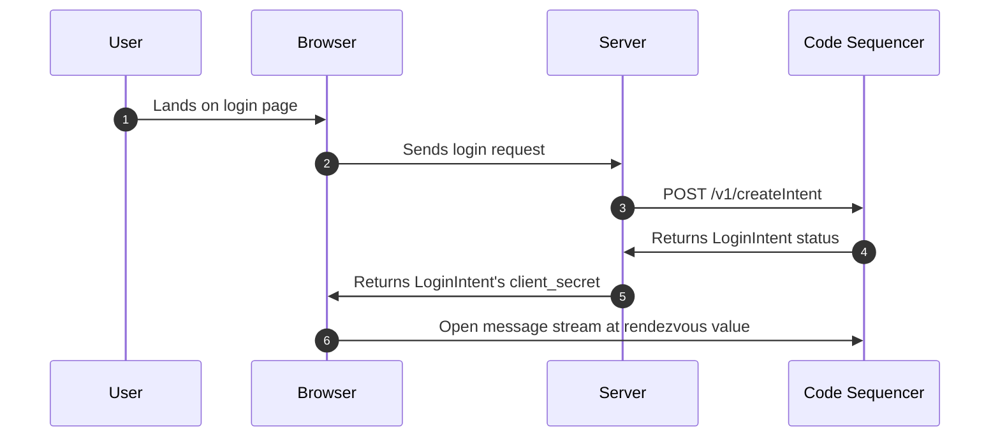

# Login with Code

The **Login with Code** feature allows you to authenticate users seamlessly through their Code Wallet. This modern authentication flow leverages the power of blockchain to provide secure and decentralized user verification.

## Requirements

To implement **Login with Code**, ensure you have the following:

1. **Verifier Key Pair:**
   - Generate a verifier key pair that will be used to sign authentication requests. 

::: tip
   You can use the `Keypair.generate()` method from the `@solana/web3.js` library. Or you can use the `Keypair.generate()` method from the `@code-wallet/keys` library. Additionally, the solana keygen cli can be used to generate a keypair using `solana-keygen new`.
:::

2. **Public Key Hosting:**
   - Host your verifier's public key at `https://yourdomain.com/.well-known/code-payments.json`.
   - The public key must be accessible from the root of your domain using **HTTPS** (not HTTP). 
   - Subdomains are **not** supported.

## Flow Overview

The **Login with Code** flow consists of the following steps, which are largely handled by the Code SDK:



If you are using the Code SDK, you can create a login intent using the `code.loginIntents.create()` method. This method will return a `clientSecret` that you can use to authenticate the user. This `clientSecret` is used to create a button that will trigger the login flow.

::: tip NOTE
This feature is currently not supported by the PHP, Python, or Go libraries. These SDKs will be updated to support this feature in the future.

In the meantime, you can achieve the same functionality by sending a POST containing a signed `RequestToLogin`. You can read more about this in our [Code API](./custom-backends) section.
:::

## Example Login Integration

Below is an example using **Express.js** to set up server-side authentication.

### Server-Side

```js
import * as code from "@code-wallet/client";
import { Keypair } from '@code-wallet/keys';
import express from "express";

const app = express();
const verifier = Keypair.generate(); // Don't actually generate a new keypair each time
const domain = "example.com";

app.post('/login', async (req, res) => {
  const { clientSecret, id } = await code.loginIntents.create({
    login: {
      verifier: verifier.publicKey.toBase58(),
      domain: domain,
    },
    signers: [ verifier ],
  });

  res.send({ clientSecret });
});

app.get('/.well-known/code-payments.json', (req, res) => {
  res.json({ "public_keys": [ verifier.publicKey.toBase58() ] });
});

// Endpoint to check login status
app.get('/status/:intent', async (req, res) => {
  const { intent } = req.params;
  const status = await code.getStatus({ intent });
  const user = await code.getUserId({ intent, verifier });
  res.send({ status, user });
});

app.listen(3000, () => {
  console.log('Server running on port 3000');
});
```

### Client-Side Integration

```html
<!DOCTYPE html>
<html lang="en">
<head>
  <meta charset="UTF-8">
  <title>Login with Code</title>
</head>
<body>
  <button id="login-button">Login with Code</button>

  <script type="module">
    import code from 'https://js.getcode.com/v1';

    const loginButton = document.getElementById('login-button');

    loginButton.addEventListener('click', async () => {
      const response = await fetch('/login', { method: 'POST' });
      const { clientSecret } = await response.json();

      const { button } = code.elements.create('button', {
        login: {
          clientSecret: clientSecret,
          verifier: 'your-verifier-pubkey', // Replace with your verifier public key
        }
      });

      button.on('success', (event) => {
        console.log('Login successful:', event);
        // Redirect or update UI as needed
      });

      button.mount('#login-button');
    });
  </script>
</body>
</html>
```

You should now have a working **Login with Code** integration that allows users to authenticate using their Code Wallet.


## Important Notes

  1. Use a verifier keypair to create a login intent.
  2. Deploy your verifier's public key at `https://yourdomain.com/.well-known/code-payments.json` using HTTPS.
  3. Ensure the public key is hosted at the root of your domain; subdomains are unsupported.
  4. Hosting the `.well-known/code-payments.json` file over HTTP will **not** work—HTTPS is mandatory. 

## Further Reading

- [6-minimal-purchase-with-login](https://github.com/code-payments/code-sdk/tree/main/examples/6-minimal-purchase-with-login)
- [7-minimal-login](https://github.com/code-payments/code-sdk/tree/main/examples/7-minimal-login)

## Live Example

Visit [Pennypost](https://pennypost.co) for a live demonstration.
