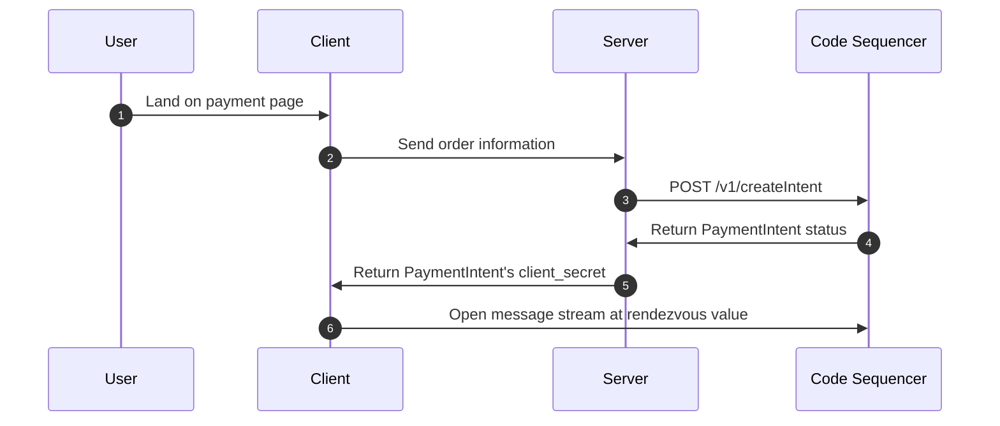
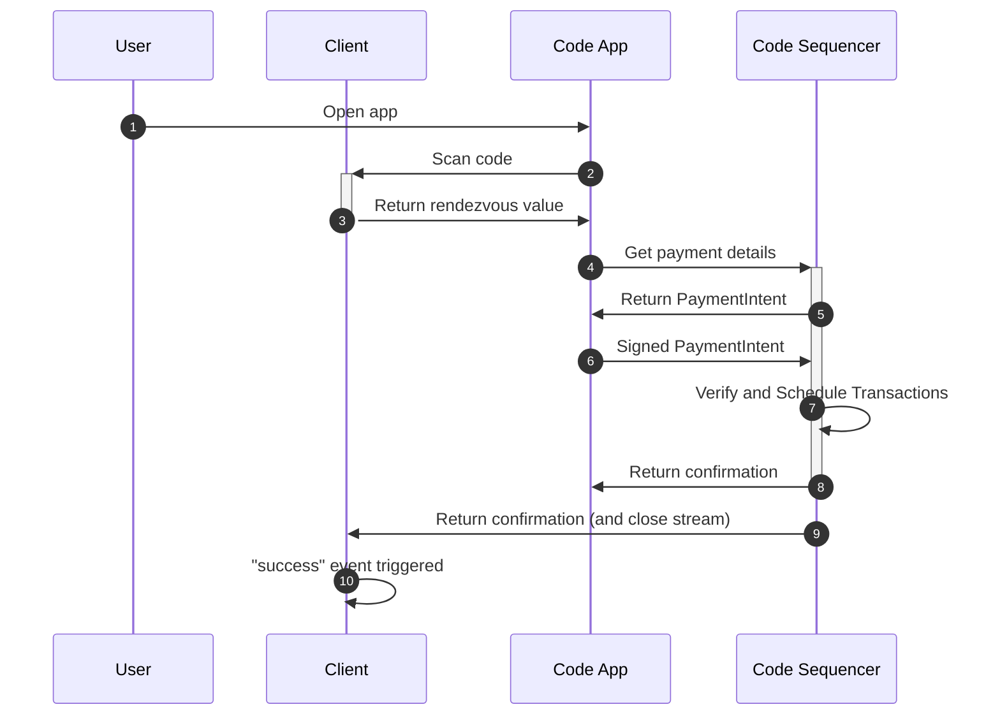
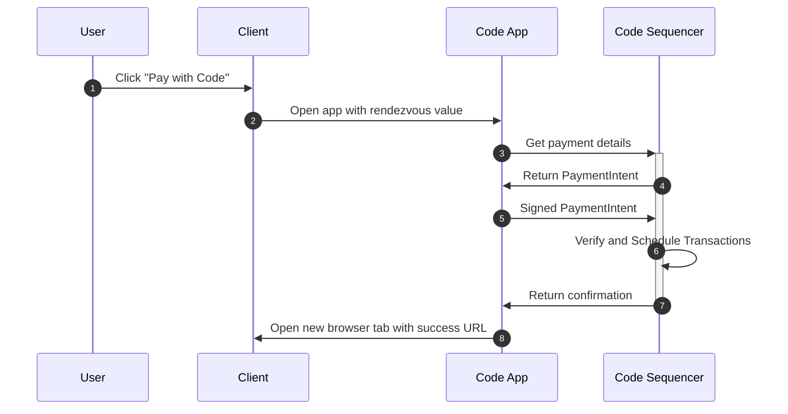

# Introduction

Code uses the concept of a payment intent to represent a user's intent to pay another user. This is different from a blockchain transaction. A payment intent is a higher-level abstraction that represents a user's intent to pay another user which is a way to represent a payment in a way that's more familiar to users.

If you'd like to learn more about intents in general, please refer to the [Intents](../intents/introduction) introduction.

## Payment Intents

In this section, we'll discuss how to setup a payment request and create a payment intent that you can verify on your server. 

Regardless of whether your user is on a mobile device or desktop environment, the payment flow will start with the following sequence.




Typically, you'll have a payment button on your website. For example, you might have a button that looks like this:

<div id="button-container"></div>

When a user clicks the button, an `invoke` event is triggered, allowing you to communicate with your backend; perhaps to check for inventory. On the server side, you'll create a payment intent and return the `clientSecret` to the browser. This value is then used to generate a [rendezvous](../reference/rendezvous) value on the button.

::: code-group

```js [client.js]
const { button } = code.elements.create('button', { ... });

...

button.on('invoke', async () => {
  // This is called when the "Pay with Code" button is clicked.

  // Send the order information to your server.
  const res = await fetch('/create-intent', { method: 'POST', ... });
  const { clientSecret } = await res.json();

  // Update the button with the new client secret generated by the server.
  button.update({ clientSecret });
});
```

```js [server.js]
app.post('/create-intent', async (req, res) => {
  // Create intent (notify the code API that a payment is coming soon)

  const { clientSecret, id } = await code.paymentIntents.create({ ...  });

  // This value needs to be sent to the browser so that the browser can use it
  // to setup a payment with this intent instance.
  res.send({ clientSecret });
});
```
:::

## Mobile vs. Desktop Flows

Depending on whether your user is on a mobile device or a desktop, the payment flow will be slightly different. On the mobile flow, the app can be opened directly from the browser. On the desktop flow, the user will need to scan a code using the Code app.

### Desktop Flow

On desktop, the user will be presented with a scannable code. They can use the Code app to scan this code and complete the payment. Once the payment is complete, a `success` event will be triggered on the button. You can also wire up a redirect URL to redirect the user to a success page. See [Browser Events](../reference/browser-events) to learn more.



### Mobile Flow

On mobile, the user will be prompted to open the Code app to complete the payment. Once inside the Code app, the user will be prompted to confirm the payment. Once confirmed, the payment will be sent to the Code Sequencer. If successful, the Code app will then redirect the user to a new tab in their default browser. The `success` event will be triggered on the button in the original tab. You can also wire up a redirect URL to redirect the user to a success page.



::: warning
The default browser could be different than the one they came from. Additionally, the user will definitely be redirected to a new tab. This is a limitation of Android and iOS. There is no garantuee that the user will go back to the tab they came from and therefore the `on("success", ...)` event may not be triggered.

See [Confirmation URLs](../reference/browser-events#confirmation-urls) to learn more.
:::

## Example

You can find a full example [here](../examples/payment-verification).
