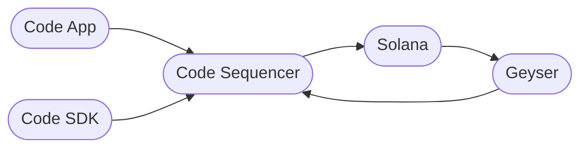
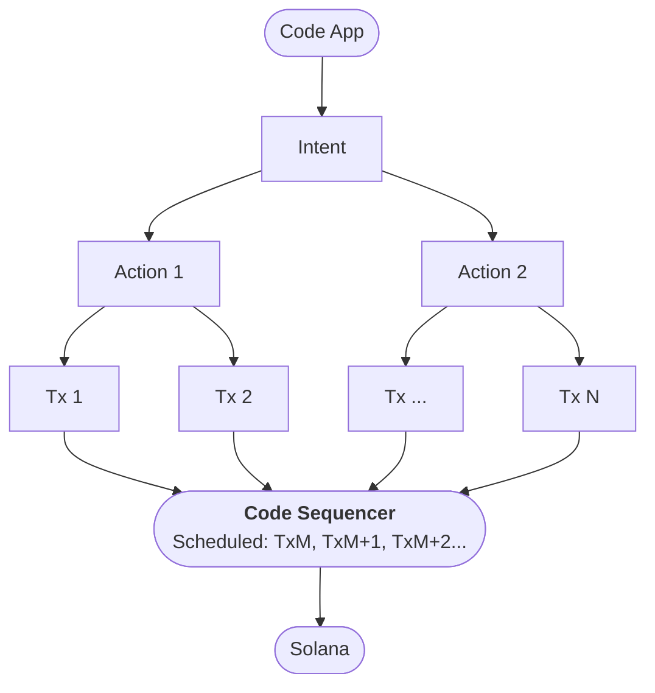

# Code Sequencer
To break into mainstream adoption, payments need to be instant and they need to be guaranteed. If a user has to wait, or they get a failed transaction they will think the experience is broken, and when you're dealing with money the experience cannot feel broken. That is why we built the Code Sequencer. Solana is fast, but even with an average block time of ~400ms, there are periods of volatility where the block time can creep up over 1 second. We need things to be predictably instant. 

The other challenge is that payments routinely aren’t included in the next block, and without a mempool these payments end up failing on the application side. Again making for a broken experience for consumers. 

The Code Sequencer addresses these challenges gracefully managing the "pending confirmation" periods inherent to all blockchains to deliver an instant experience for the user.

The Code Sequencer aims to offer speed, reliability, and privacy in transactions. All users know is that payments "just work" every time, but under the hood, the Code Sequencer is seamlessly handling all of the complexity and unpredictability of on chain operations.

## Why the Code Sequencer?
Traditional blockchain confirmations aren't ideal for on-the-spot transactions, like grabbing a coffee. The Code Sequencer facilitates instant transfers, ensuring that once a payment commitment is made by a user, it's final.

### Features

* **Instant Transactions**: Offers instant fund transfers.
* **Reliability**: Utilizes nonced transactions for security and preventing double spends.
* **Privacy**: Interacts with the Splitter program to upgrade payment intents, safeguarding user account and payment details.

The Code Sequencer is **permissionless and self-custodial**. It doesn't hold a user's funds or private keys, it only schedules signed transactions. Users are able to use the underlying Solana blockchain directly if necessary. There is an open source tool to do so called the [Timelock Explorer](https://github.com/code-payments/timelock-explorer/tree/main).

::: warning Access Keys
The Code Sequencer never sees or knows the private keys of a user's accounts or their private key (What Code refers to as an "Access Key").
:::

## How to Use the Code Sequencer
As a Code app or Code SDK user, there is nothing you need to do to use the sequencer. It's built into the Code app and SDK.

The Code Sequencer is a Layer 2 (L2) system that works in tandem with the Code app. The Code app is the primary interface for users to send money or make payments, and that experience is powered by the Code Sequencer. The Code Sequencer, in turn, submits payments to the Solana blockchain. 

## How It Works

Put simply, the Code Sequencer maintains a global state and runs a local simulation of submitted [Intents](../intents/introduction.md). It is the Code Sequencer's job to ensure that state transitions are valid and that referenced accounts are in locked state. Submitted intents are scheduled and sent to the Solana blockchain asynchronously.

The internals of the sequencer are quite complex, but the basic flow can roughly broken down into the following: 

When an intent is created on the mobile app, a set of actions are required to fulfill that intent. These actions can be composed into transactions with durable nonce values provided by the Code Sequencer. The transactions are then signed and sent to the Code Sequencer. The Code Sequencer then validates the transactions and schedules them to be submitted to the Solana blockchain.

For example, when a user sends Digital Paper Cash using the Code App, the result is an `Intent`. The mobile app will eventually compose the intent into several transactions during the life-cycle of the intent. 

This follows 4 steps:

1. **Local Simulation**: The mobile app will submit the intent to the Code Sequencer. The Code Sequencer will confirm the state transitions are valid based on the global state. If valid, the Code Sequencer will respond with [durable nonce](https://docs.solana.com/offline-signing/durable-nonce) values that should be used to sign transactions as part of the intent.
2. **Transaction Submission**: Assuming the intent is valid, the Code app will then construct a set of transactions that fulfill the intent and sign them using the provided durable nonces. These transactions get sent as signatures to the Code Sequencer, which then re-constructs the transactions from the original intent. If any of the account values don't line up, the signatures would not be valid and would get rejected by the Sequencer (and Solana). 
3. **Transaction Scheduling**: If the signatures are valid, the Code Sequencer will update its global state. The transactions are scheduled asynchronously, along with transactions from other users, to be sent to the Solana blockchain.
4. **Confirmation**: The Code Sequencer will then send a confirmation to the Code app that the intent has been fulfilled.

This is a highly simplified overview. To learn more, please refer to the [Code Privacy Protocol](./splitter.md).

