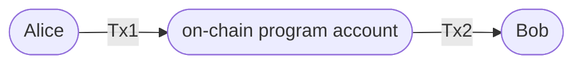
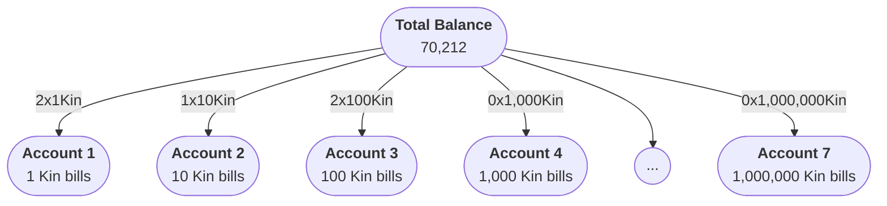

# Code Privacy Protocol

Blockchains unlocked a new financial paradigm with their open and permissionless nature. The challenge is this often comes at the cost of privacy. On blockchains, like Solana, when Alice makes a payment to Bob, both parties gain insight into each other's account balances. And if Charlie has ever paid Alice, he will see her payment to Bob, and know Bob's account balance. A simple payment unlocks the ability to view the entirety of another party's financial state and history. This level of exposure is a standard characteristic across many blockchains, not just Solana. 

Our view is that basic privacy is a fundamental requirement for any payments product. Without it, a user's financial life is on display, including what they have and who they've paid. 

To address this privacy concern, we have developed the Code Privacy Protocol. This protocol seeks to ensure confidentiality of both account balance and individual payments, providing users with a degree of privacy without compromising the integrity and security inherent in blockchain systems. 

Privacy taken too far, however, can lead to bad outcomes. To mitigate the potential of Code being used for nefarious activity, Code users are limited to `$250 USD` per payment, up to `$1000 USD` per day. 

::: info Note
This document is fairly dense and aimed at those who are familiar with Solana and blockchains. If you're new to Solana, we recommend you start with the [Solana docs](https://docs.solana.com/). Additionally, familiarity with [Merkle Trees](https://en.wikipedia.org/wiki/Merkle_tree) is helpful.
:::

## Overview
As part of the [Code Sequencer](./sequencer), we added a layer of privacy so that Code users would feel safe using the Code app. We want to ensure that users can transact without worrying about their account balances or payment history being exposed to the world. To do this, we developed the Code Privacy Protocol.

::: info Note on Zero-Knowledge Proofs
While developing this feature, we didn't want to introduce any new cryptographic primitives or complex algorithms. We wanted to use existing primitives and algorithms that were well understood and well tested. 

The protocol may change in the future as zero-knowledge proofs become more practical. We've built everything on top of the [Intent](../intents/introduction) system to ensure that such a change could be made.
:::

The protocol has five main components:

1) [Temporary privacy](#temporary-privacy): At minimum, the privacy of a user's account balance is protected for a short period of time. This is accomplished by using a durable nonce to delay the submission of transactions to the Solana blockchain.
2) [Upgraded privacy](#upgraded-privacy): The process of breaking the association between commitments and payments on-chain. This is our process for taking a temporary privacy guarantee and making it permanent.
3) [Anonymised amounts](#anonymised-amounts): The total balance is split into multiple denominations and each denomination is sent to a different account. This makes it difficult to determine the total balance of a user's account as well as the amount of a specific payment.
4) [Shielded accounts](#shielded-accounts): Every payment intent is routed through newly derived outgoing and incoming accounts. These accounts protect the total balance and only include the payment being made.
5) [Batched transfers](#batched-transfers): To obscure the association between a user's balance and any transaction, the protocol waits for enough similar denominated payments to be made before submitting them to the Solana blockchain.

While there is a lot going on, the protocol is fairly simple and uses existing primitives. Typical transfers are about `~25` low-compute transactions on-chain. The mobile app handles the nuances of the protocol, so users don't have to worry about it. 

For a deep dive, continue reading.

## Background

Before we can cover the protocol, we need to cover some basics. Specifically, [transactions](https://docs.solana.com/developing/programming-model/transactions) and [durable nonces](https://docs.solana.com/offline-signing/durable-nonce) on Solana. If you're comfortable with these concepts, feel free to skip ahead.

### Transactions on Solana
Every transaction on Solana includes a fee payer, at least one signature (the fee payer), and a recent blockhash. The fee payer is the account that pays the transaction fee but is not necessarily the owner of the accounts that the transaction interacts with. The signatures cover the message and the recent blockhash. The recent blockhash is used to prevent replay attacks.

Importantly, the Solana blockchain generates a new blockhash value roughly every `~400ms` and it keeps a list of recent blockhash values. Any transaction that is submitted must use a recent blockhash value. If a Solana validator receives a transaction with a blockhash value that is not in the recent blockhash list, the transaction will be rejected.

### Durable Nonces
Durable nonces are a Solana feature that allows for the creation of a [nonce account](https://docs.solana.com/implemented-proposals/durable-tx-nonces) that can be used to store a blockhash derived value. This value can then be used instead of a blockhash and allows users to get around the recent blockhash requirement mentioned above. The primary use case is to give users time to sign multi-sig transactions.

::: warning Nonce Value
Importantly, if a transaction using a durable nonce is submitted, the value of the durable nonce is advanced. This prevents replay attacks. It doesn't matter if the transaction fails or succeeds, the value of the durable nonce is advanced.
:::

This means that a durable nonced transaction has similar semantics to that of writing a [cheque](https://en.wikipedia.org/wiki/Cheque). A cheque can be cashed at any time, but it doesn't guarantee that the funds are available. Similar to how a cheque can bounce, a transaction using a durable nonce can fail if the account doesn't exist or have enough funds.

However, when combined with a [Timelock](./timelock.md) account, a durable nonced transaction is guaranteed to succeed within a certain time period. So long as the Timelock account has been observed to have enough funds, the transaction will succeed. To ensure that a Timelock account has the requisite funds while giving time for the Code Sequencer to accumulate enough batched transactions the current unlock period for a Timelock account is set to 21 days. 

## Conditional Payments

User-to-user payments on the Code app use the Code Sequencer (and its on chain programs) to split transactions into multiple transactions. Specifically, when Alice sends tokens to Bob, she instead sends the tokens to an on chain program, which then forwards the tokens to Bob. 

Instead of this:


Transfers on the Code app look like this (2 transactions):



We use an audited [on-chain program](https://github.com/code-payments/code-program-library/tree/main/splitter) to ensure that `Tx1` can only be successfully executed after `Tx2`. This condition is on-chain and cannot be forged. The condition is important because it ensures that the program cannot be used to steal funds from Alice.

The on-chain program advances tokens to Bob through `Tx2` first. Ensuring that Bob has non-custodial access over the tokens immediately. In doing so, the on-chain program writes a receipt for this action to its on-chain merkle tree. This receipt is then used as a `proof-of-payment` to prove that Bob has been paid when submitting `Tx1` afterwards. This is analogous to Alice writing a cheque to the Code Sequencer conditional on Bob receiving equal tokens first.

## Temporary Privacy

At minimum, Code users can expect their account and balance to be private for a short period of time. This was our initial goal when we started building the Code Privacy Protocol. We wanted to ensure that users could transact in the real world without worrying about their account balances being exposed during a purchase.

The Code Sequencer will hang onto the `Tx1` transaction from the [example](#conditional-payments) above, for as long as possible before submitting it to Solana. An observer would see that Bob has received tokens but the source is hidden until `Tx1` is submitted. This is what we refer to as `Temporary Privacy`.

While `Temporary Privacy` is a big step forward in protecting users, there is a lot more the protocol does to provide additional privacy guarantees to users. We'll cover these additional guarantees further down.

## On-Chain Program

We briefly mentioned above that an on-chain program is used to provide `proof-of-payment` and enables `conditional payments`. Anyone can use our on-chain program to create their own  associated treasury account. The treasury account can then be used to make token payments to any recipient. All payments made out of the treasury always result in a receipt being generated and stored on-chain. This receipt and private payment details can then later be used to create a special destination account that can only exist if the payment was actually made in the first place.

The on-chain program is called `Splitter`. It is open source and can be found [here](https://github.com/code-payments/code-program-library/tree/main/splitter). Review the [tests](https://github.com/code-payments/code-program-library/blob/main/splitter/tests/cases/happy-path.ts#L188-L307) for more details on how it works.

## Commitments

A critical component to our privacy protocol is the use of `commitment` values. A commitment is a Program Derived Address ([PDA](https://solanacookbook.com/core-concepts/pdas.html#facts)) from a hash of the payment details and is associated to a particular treasury account. 

::: warning Destination and Amount
The privacy protocol allows for the `destination` and `amount` to be publicly visible as those are made confidential through the use of [Anonymised Amounts](#anonymised-amounts) and [Shielded Accounts](#shielded-accounts). The `source` account never makes it on-chain and is completely private.
:::

While there is no on-chain constraint regarding how the commitment value is defined, our approach boils down to this:
  
```typescript
function getPrivatePaymentHash(payment: Payment) {
    const seeds = Buffer.concat([
        payment.mint.toBuffer(),
        payment.src.toBuffer(), // private
        payment.dest.toBuffer(),
        Buffer.from(payment.amount.toString()),
        Buffer.from(payment.timestamp.toString()),
        payment.nonce,
    ]);
    return sha256(seeds);
}

function getCommitmentPda(state: State, payment: Payment) {
  return PublicKey.findProgramAddress(
    [
      "commitment_state",
      state.treasury.toBuffer(),
      state.recentRoot,
      getPrivatePaymentHash(payment),
      payment.destination.toBuffer(),  // shielded account
      payment.amount.toBuffer('le', 8) // anonymised amount
    ],
    PROGRAM_ID
  )
}
```

Using the [example](#conditional-payments) above, the commitment is used to create a destination address in `Tx1` that can only exist if the payment was actually made in `Tx2`. If `Tx1` were submitted first, then the transaction would fail as the destination address could not exist. There is no way to create this account without issuing `Tx2` first and then opening the destination address through the on-chain program.

## Upgraded Privacy

Now that you have an understanding of `conditional payments`, `commitments`, and the `on-chain program`, we can cover how we provide `upgraded privacy` to Code users.

After making a payment, whether it happens to be on the next app open or during another payment, the Code app will ask the Code Sequencer if there are any pending temporary privacy transactions that can be upgraded to permanent privacy. If there are, the Code Sequencer will respond with a `Merkle Proof` that can be used to re-create the original temporary privacy transaction for a past intent but with a different commitment value. The merkle proof can be used to prove that the original payment is included within a more recent merkle tree root. The mobile app can then re-create the original `Tx1` transaction with the new commitment value and submit it to the Code Sequencer. This effectively breaks the connection between `Tx1` and `Tx2` on-chain.

::: warning Atomicity of Durable Nonce Transactions
One very important property of transactions that include a [durable nonce](#durable-nonces) is that we can create many transactions against the same durable nonce value. Only one of these transactions can ever be executed on-chain (successfully or not). The rest will fail because the durable nonce value will be advanced atomically after the first transaction is submitted. It doesn't matter if the first transaction is successful, the nonce value will be advanced.


This means that **it is safe to provide the Code Sequencer with two transaction variations of the same intent**. The Code Sequencer will only ever be able to execute one of them on the Solana blockchain.
:::


Reviewing our example from above, the `Tx2` transaction will be submitted at some point. Unrelated transactions from other Code users will also land. These will change the on-chain Merkle Root value. When the Code app is opened again, the Code Sequencer will respond with a merkle proof that can be used to re-create the original `Tx1` transaction with a new commitment value. This new commitment value will be based on some recent Merkle Root value. The Code app has all the information it needs to calculate if the provided proof actually includes the `Tx2` transaction. The Code app can then submit the new `Tx1` transaction to the Code Sequencer. 

::: warning Validity Safeguards
Importantly, if the Code Sequencer gives a proof that is not a valid on-chain proof, it is effectively ensuring that the transaction could not be executed on chain. 

It is not possible for the Code Sequencer to submit a transaction that would result in a loss of funds for a user. Additionally, because an advance was issued for `Tx2`, it is in the Code Sequencer's best interest to ensure that `Tx1` is submitted to the Solana blockchain successfully.
:::

You can view a distilled example of this flow in the [code-program-library](https://github.com/code-payments/code-program-library/blob/main/splitter/tests/cases/happy-path.ts#L188-L307).

## Anonymised Amounts

One of the challenges with the `Upgraded Privacy` approach above is that the `amount` of the payment is publicly visible. We solve for that using `Anonymised Amounts`. At a high level, all transactions are made using one of `63` possible amounts (7 x 9 bill types). The Code app will automatically split the payment intents into multiple transactions. The sum of all the transactions will equal the original payment amount.

More specifically, the Code app stores the balance across multiple accounts. Each account is associated with a different denomination that is derived from their access key. For example, a user's balance might be stored across 7 accounts, each storing a different denomination. The total balance is the sum of all the accounts. This is roughly analogous to how you might store your balance in a [Monopoly tray](https://www.google.com/search?q=monopoly+tray). When a user makes a payment, the Code app will split that payment intent into multiple transactions, each coming from one of the denominations.



For example, if Alice is paying Bob `70,212 Kin`, then the Code app will split that payment into 7 transactions. Each transaction will be for a different amount, but the sum of all the transactions will equal the original payment amount. 

In practice, this requires using the [change making](https://en.wikipedia.org/wiki/Change-making_problem) algorithm to determine the best way to split the payment. The Code app will then submit each transaction to the Code Sequencer. 

## Shielded Accounts

We briefly spoke about multiple accounts above for storing a user's total balance. In addition to those accounts, we use two additional accounts for every payment intent. These accounts are called `shielded accounts` and are used to protect the privacy of the payment amount and the total balance. 

Before a payment is made, the amount for that payment is moved to a newly derived `outgoing` account. This account is then used to make the payment. After the payment is made, the amount is moved to a newly derived `incoming` account on the recipient side. This account is then used to receive the payment into their denomination accounts.

In practice, this results in roughly `~25` transactions total for a typical payment (including account rotations, denomination movements, re-organizations, etc...). The Code app handles all of this for the user. 

You can review the derivation strategy for these accounts under the [Timelock](../reference/timelock#account-derivation) section.

## Batched Transfers

The final component of our privacy protocol is `batched transfers`. This is a fairly simple concept. Instead of submitting a transaction to the Solana blockchain for every payment, the Code Sequencer will wait until it has enough similar payments to batch them together. This is done to obscure the association between a user's balance and any transaction.

We have 63 possible payment types, so in practice we wait for at least `1 in 10` transactions to be similar before submitting them to the Solana blockchain.
